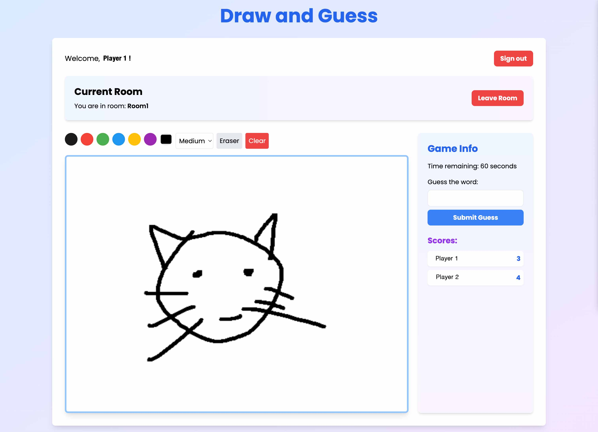

# Draw and Guess

Draw and Guess is a real-time multiplayer drawing and guessing game built with Vue.js and Firebase. Players can create or join rooms, draw pictures based on given words, and guess what others are drawing.

## Features

- **Real-time Drawing**: Draw on a shared canvas with other players in real-time.
- **Authentication**: Sign in with Google to play.
- **Room Management**: Create or join rooms to play with friends.
- **Game Logic**: Take turns drawing and guessing words.
- **Responsive Design**: Optimized for both desktop and mobile devices.

## Getting Started

### Prerequisites

- Visual Studio Code installed
- Firebase project set up

### Installation

1. Clone the repository:

2. Set up Firebase:
    - Create a Firebase project in the [Firebase Console](https://console.firebase.google.com/).
    - Copy your Firebase configuration and replace the placeholder in `js/firebaseConfig.js`.

3. Go Live:
    - Open the project in Visual Studio Code.
    - Use the "Go Live" extension to start a local server.

## Project Structure

- `index.html`: Main HTML file for the application.
- `js/app.js`: Main JavaScript file containing Vue.js logic and Firebase interactions.
- `css/styles.css`: Custom styles for the application.

## Configuration

Ensure your Firebase configuration is correctly set up in `js/firebaseConfig.js`:
